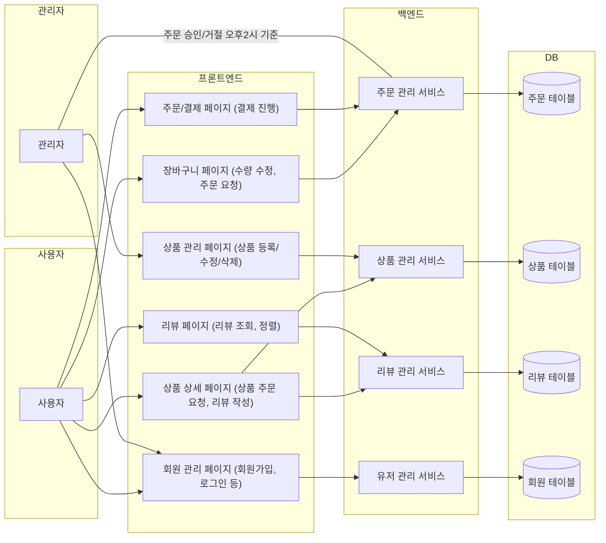
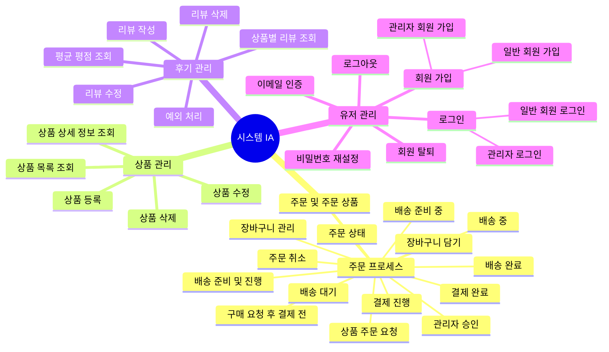

# Online Coffee Shop
커피 메뉴 관리 및 사용자의 상품 주문에 따른 주문 상태 관리

## 프로젝트 기간
2025/02/19 12:00 ~ 2025/02/27 12:00

## 구성원
[장무영](https://github.com/wkdan), [신동훈](https://github.com/SDHSeoulTech), [신윤호](https://github.com/messiteacher), [최재우](https://github.com/cjw0324)

## 컨벤션
[🔗 컨벤션 Wiki 바로가기](https://github.com/prgrms-be-devcourse/NBE4-5-1-Team09/wiki/%EC%BB%A8%EB%B2%A4%EC%85%98)

## 시스템 명세서

[🔗 시스템 명세서 Wiki 바로가기](https://github.com/prgrms-be-devcourse/NBE4-5-1-Team09/wiki/%EC%8B%9C%EC%8A%A4%ED%85%9C-%EB%AA%85%EC%84%B8%EC%84%9C)

## DB ERD (ver.0.1)
[https://www.erdcloud.com/team/kKm3uNXtgGF56Jrxx](https://www.erdcloud.com/d/qYquDQt26SnfLaJR4)

## 시스템 아키텍처

## 시스템 흐름도 초안

## 시스템 IA

